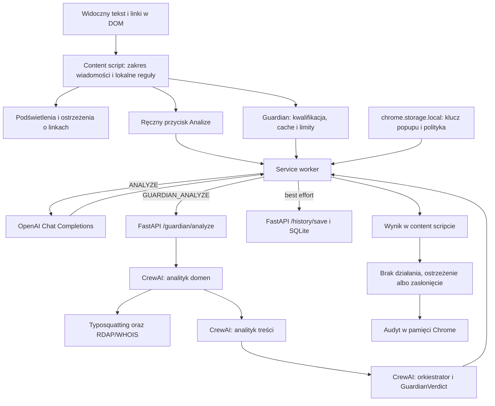

# Phishing Guard — dokumentacja techniczna i instrukcja obsługi

Stan opisu: 2026-09-08. Dokument opisuje implementację znajdującą się w
repozytorium. Nazwa rozszerzenia w Chrome to `Phishing Extension MVP`, a
interfejs posługuje się nazwami `Phishing Guard` i `Guardian`.

## Spis treści

1. [Elementy systemu](#1-elementy-systemu)
2. [Wymagania](#2-wymagania)
3. [Instalacja bibliotek i uruchomienie backendu](#3-instalacja)
4. [Klucze API i modele](#4-klucze-api-i-modele)
5. [Instalacja w Chrome](#5-instalacja-w-chrome)
6. [Obsługa rozszerzenia](#6-obsluga)
7. [Architektura i przebieg analizy](#7-architektura)
8. [API, dane i konfiguracja](#8-api-i-dane)
9. [Gotowe wyniki i Streamlit](#9-streamlit)
10. [Własne benchmarki](#10-wlasne-benchmarki)
11. [Rozwój i testy](#11-rozwoj-i-testy)
12. [Rozwiązywanie problemów](#12-problemy)
13. [Ograniczenia implementacji](#13-ograniczenia)

<a id="1-elementy-systemu"></a>

## 1. Elementy systemu

| Element | Zadanie | Kiedy jest potrzebny |
| --- | --- | --- |
| Rozszerzenie Chrome | Odczyt widocznego tekstu i linków, podświetlenia, popup, ręczna analiza, Guardian | Do pracy na stronach |
| FastAPI na porcie 8000 | Endpoint Guardiana i zapis historii w SQLite | Do automatycznej analizy CrewAI i wykresów historii |
| `GuardianClassic` / CrewAI | Analiza domen, analiza treści i synteza werdyktu | Gdy wywoływany jest `/guardian/analyze` |
| OpenAI API | Model dla ręcznej analizy i domyślnej konfiguracji backendu | Przy analizach AI |
| `dashboard.html` | Historia analiz użytkownika i lokalny audyt Guardiana | Otwierany z popupu rozszerzenia |
| Streamlit na porcie 8501 | Porównanie wyników eksperymentów Direct/CrewAI | Do oglądania benchmarków |
| `benchmark_cli.py` | Walidacja kampanii, pomiar, scoring i porównanie | Do własnych eksperymentów |
| `playground.html` | Lokalna demonstracyjna skrzynka z syntetycznymi wiadomościami | Do sprawdzania zachowania rozszerzenia |

`dashboard.html` oraz Streamlit prezentują różne dane. Pierwszy czyta historię
użytkowania rozszerzenia, drugi eksporty benchmarków. Uruchomienie Streamlit
nie uruchamia backendu ani rozszerzenia.

<a id="2-wymagania"></a>

## 2. Wymagania

| Składnik | Wymaganie projektu |
| --- | --- |
| Przeglądarka | Chrome z obsługą Manifest V3 i możliwością włączenia trybu dewelopera |
| Node.js | Do instalacji wybierz 22.x lub 24.x; zablokowana zależność Tailwind wymaga co najmniej Node 20 |
| npm | Dostarczany z Node.js; instalacja przez `npm ci` i `package-lock.json` |
| Python | Zalecany 3.13; pakiet Guardian deklaruje `>=3.10,<3.14`, a osobny dashboard ma własne wymagania bibliotek |
| `uv` | Instalacja środowiska CrewAI z `uv.lock` i pozostałych pakietów Python |
| Git | Klonowanie i wersjonowanie kodu, danych syntetycznych i konfiguracji |
| Dostęp do sieci | Pobranie bibliotek, wywołania modeli oraz RDAP/WHOIS w produktowym Guardianie |
| Klucz API | Własny klucz dostawcy z dostępem do wybranego modelu i dostępnym limitem API |

Nie potrzeba własnego GPU, Dockera, osobnego serwera bazy danych ani konta
CrewAI AMP. Modele wykonują się u dostawcy API, a SQLite działa lokalnie.
Samo oglądanie dołączonych benchmarków wymaga wyłącznie środowiska dashboardu.

Instalatory narzędzi są dostępne na stronach [Node.js](https://nodejs.org/),
[Pythona](https://www.python.org/downloads/) i [Gita](https://git-scm.com/downloads).
Jeżeli masz już działający Python z pip, `uv` możesz zainstalować poleceniem
`python3 -m pip install uv`; przy ograniczeniach systemowego Pythona użyj
[instrukcji instalacji uv](https://docs.astral.sh/uv/getting-started/installation/).

Sprawdź narzędzia:

```bash
git --version
node --version
npm --version
uv --version
```

<a id="3-instalacja"></a>

## 3. Instalacja bibliotek i uruchomienie backendu

### 3.1. Pobranie projektu

Skopiuj adres repozytorium z przycisku **Code** w swoim serwisie Git:

```bash
git clone <URL_REPOZYTORIUM> phishing-extension
cd phishing-extension
```

`<URL_REPOZYTORIUM>` zastąp prawdziwym adresem. Dalsze komendy wykonuj z
katalogu zawierającego `manifest.json` i `package.json`, chyba że polecenie
wyraźnie zmienia katalog. Główne przykłady używają macOS/Linux i powłoki
Bash lub Zsh.

### 3.2. Biblioteki i build rozszerzenia

```bash
npm ci
npm run build
```

`npm ci` instaluje wersje z `package-lock.json`. `npm run build` uruchamia
TypeScript (`tsc --noEmit`), bundler esbuild oraz Tailwind CSS. Wynikiem są:

```text
dist/
├── background.js
├── content.js
├── dashboard.js
├── popup.js
└── styles.css
```

Chrome odwołuje się do tych plików przez `manifest.json`, `popup.html` i
`dashboard.html`. `dist/` i `node_modules/` są ignorowane przez Git, dlatego
build trzeba wykonać także po świeżym sklonowaniu repozytorium.

### 3.3. CrewAI i backend

Z katalogu głównego repozytorium:

```bash
uv sync --project backend/guardian --locked --python 3.13
cd backend
uv pip install --python guardian/.venv/bin/python -r requirements.txt
cd ..
```

Pierwsze polecenie tworzy `backend/guardian/.venv` i instaluje projekt według
`backend/guardian/uv.lock`. `--locked` zgłasza niespójność lockfile zamiast
aktualizować go podczas instalacji. `uv` może pobrać Python 3.13, jeśli nie
ma odpowiedniego interpretera lokalnie.
[Znaczenie synchronizacji i lockfile](https://docs.astral.sh/uv/concepts/projects/sync/).

Drugie polecenie dodaje FastAPI, Uvicorn, SQLModel i pakiet Guardian w trybie
editable. Musi być uruchomione z `backend/`, ponieważ `requirements.txt`
zawiera względny wpis `-e ./guardian`.

| Zależność | Rola |
| --- | --- |
| `crewai[google-genai,tools]==1.15.8` | Agenci, zadania, narzędzia i obsługa providerów |
| `google-genai==1.65.0` | Natywne wywołania Google w odpowiednich profilach CrewAI |
| `idna`, `tldextract`, `python-levenshtein` | Normalizacja i analiza domen |
| `python-whois` | Fallback WHOIS dla daty rejestracji domeny |
| `fastapi`, `uvicorn`, `sqlmodel` | HTTP API, serwer i historia SQLite |
| `python-dotenv`, Pydantic | Wczytywanie konfiguracji i walidacja; instalowane w drzewie zależności |

FastAPI, Uvicorn i SQLModel nie mają przypiętych wersji w
`backend/requirements.txt`; lockfile Guardian nie jest kompletnym lockfile
całego serwera. Nie instaluj bibliotek wizualizacji do tego środowiska.

Sprawdzenie instalacji, bez wykonywania zapytań do modeli:

```bash
backend/guardian/.venv/bin/python -c "from importlib.metadata import version; print('crewai:', version('crewai')); print('fastapi:', version('fastapi')); print('google-genai:', version('google-genai'))"
```

### 3.4. Uruchomienie API

Najpierw skonfiguruj `.env` zgodnie z następną sekcją, a następnie:

```bash
cd backend
uv run --project guardian --no-sync --env-file guardian/.env \
  python -m uvicorn main:app --host 127.0.0.1 --port 8000 --reload
```

Pozostaw terminal otwarty. Uvicorn nasłuchuje na `127.0.0.1:8000`; `--reload`
służy do pracy deweloperskiej. `Ctrl+C` zatrzymuje serwer.

- <http://127.0.0.1:8000/docs> — interaktywna dokumentacja FastAPI;
- <http://127.0.0.1:8000/openapi.json> — opis kontraktów;
- <http://127.0.0.1:8000/history/verdicts> — odczyt historii bez kosztu AI.

Sam adres `/` zwraca 404: projekt nie ma tam strony startowej ani endpointu
`/health`. Nie oznacza to awarii backendu.

Uruchomienie serwera nie uruchamia Crew. Płatna analiza zaczyna się dopiero
po żądaniu `POST /guardian/analyze`. Sprawdzenie `/docs` nie wywołuje modelu.

### 3.5. Windows / PowerShell

`npm ci`, `npm run build` i `uv sync` działają analogicznie. Ścieżka do
interpretera venv zawiera `Scripts`, a nie `bin`:

```powershell
uv sync --project backend/guardian --locked --python 3.13
cd backend
uv pip install --python guardian/.venv/Scripts/python.exe -r requirements.txt
uv run --project guardian --no-sync --env-file guardian/.env python -m uvicorn main:app --host 127.0.0.1 --port 8000 --reload
```

Pozostałe przykłady z `.venv/bin/python` przepisz na `.venv/Scripts/python.exe`.
Bloki `python - <<'PY'` są składnią Bash/Zsh; na Windows zapisz ich zawartość
jako plik `.py` i uruchom wskazanym interpreterem.

<a id="4-klucze-api-i-modele"></a>

## 4. Klucze API i modele

### 4.1. Gdzie umieścić klucze

| Zastosowanie | Miejsce konfiguracji | Kto odczytuje klucz |
| --- | --- | --- |
| Przycisk `Analize` w rozszerzeniu | Pole `Twój klucz OpenAI` w popupie | Service worker, `chrome.storage.local.apiKey` |
| Automatyczny Guardian / FastAPI | `backend/guardian/.env`: `OPENAI_API_KEY` | Proces backendu i CrewAI |
| Benchmarki OpenAI | Zmienna procesu `OPENAI_API_KEY` | CLI benchmarku |
| Benchmarki Google | Zmienna procesu `GEMINI_API_KEY` | Adapter wskazany przez kampanię |
| Streamlit / eksport statyczny | Brak klucza | Czytają gotowe pliki lokalne |

Klucz wpisany w popupie nie konfiguruje backendu. Wpis w `.env` backendu nie
konfiguruje popupu. W trybie Guardian ręczny przycisk `Analize` nadal używa
toru bezpośredniego i wymaga klucza popupu.

Utwórz własny klucz na koncie API dostawcy. OpenAI opisuje tworzenie i
eksportowanie klucza w [oficjalnym quickstarcie](https://developers.openai.com/api/docs/quickstart).
Potrzebny jest dostęp API do wybranego modelu; dostęp do samego interfejsu
czatu nie potwierdza poprawnej konfiguracji projektu API.

### 4.2. Plik `.env` backendu

Dołączony szablon:
[`backend/guardian/.env.example`](../backend/guardian/.env.example).
Jeżeli `.env` jeszcze nie istnieje, skopiuj szablon:

```bash
cp backend/guardian/.env.example backend/guardian/.env
```

Edytuj lokalny `.env`:

```dotenv
OPENAI_API_KEY=TU_WSTAW_WLASNY_KLUCZ
MODEL=gpt-4o-mini
OTEL_SDK_DISABLED=true
CREWAI_DISABLE_TELEMETRY=true
CREWAI_DISABLE_TRACKING=true
CREWAI_TRACING_ENABLED=false
```

Placeholder zastąp kluczem; nie pozostawiaj go w tej postaci. Jeżeli `.env`
już istnieje, uzupełnij go zamiast nadpisywać. `guardian_api.py` wskazuje
dokładnie `backend/guardian/.env`; pliki `.env` w katalogu głównym albo
`backend/.env` nie zastępują tej jawnej ścieżki. CrewAI może dodatkowo
wywoływać `load_dotenv()` podczas importu, dlatego warto unikać rozbieżnych
konfiguracji w kilku plikach. Eksportowane wcześniej zmienne procesu mają
pierwszeństwo przed wartościami wczytywanymi bez `override`.

Zmienne telemetryczne w szablonie są ustawieniami lokalnego uruchomienia.
Aby były dostępne już przed pierwszym importem CrewAI, uruchamiaj backend z
katalogu `backend/` przez `uv run --env-file`:

```bash
uv run --project guardian --no-sync --env-file guardian/.env \
  python -m uvicorn main:app --host 127.0.0.1 --port 8000 --reload
```

To ten sam sposób uruchomienia co w sekcji 3.4; `--no-sync` zachowuje
doinstalowane pakiety serwera. Po zmianie `.env` zatrzymaj i
uruchom backend ponownie; automatyczny reload plików Python nie musi
zauważyć zmiany konfiguracji środowiska.

Sprawdzenie, czy Git ignoruje właściwy plik:

```bash
git check-ignore backend/guardian/.env
```

Nie umieszczaj kluczy w `manifest.json`, plikach TypeScript, JSON kampanii,
README ani `benchmarks/results/`. Klucz popupu jest przechowywany w lokalnej
pamięci rozszerzenia; nie jest centralnym magazynem sekretów dla wielu
użytkowników. Każda osoba konfiguruje swój klucz.

### 4.3. Wybór modelu

Ręczny tor OpenAI ma w `src/background.ts` wpisane
`model: "gpt-4o-mini"`, `temperature: 0` i Chat Completions z wymuszonym
schematem JSON. Zmiana `MODEL` backendu nie wpływa na ten tor. Zmiana modelu
ręcznej analizy wymaga edycji kodu, buildu i przeładowania rozszerzenia.

Produktowy `GuardianClassic` nie przypina modelu osobno w agentach ani w
YAML. CrewAI 1.15.8 wybiera go ze środowiska w kolejności `MODEL`,
`MODEL_NAME`, `OPENAI_MODEL_NAME`, a następnie z wartości domyślnej biblioteki.
Szablon jawnie ustawia `MODEL=gpt-4o-mini`, żeby wynik nie zależał od tego
domyślnego wyboru.

Kampanie benchmarkowe mają własne `requested_model`, profil requestu,
limit tokenów i provider. Zmienne `MODEL` nie nadpisują zamrożonej kampanii.
Przykład własnego benchmarku poniżej używa snapshotu
`gpt-4o-mini-2024-07-18`, wymienionego w
[dokumentacji modelu](https://developers.openai.com/api/docs/models/gpt-4o-mini).
Dostępność dla konkretnego klucza potwierdza dopiero konto i odpowiedź API.

<a id="5-instalacja-w-chrome"></a>

## 5. Instalacja w Chrome

1. Wykonaj `npm ci` i `npm run build` w katalogu repozytorium.
2. Otwórz `chrome://extensions`.
3. Włącz **Tryb dewelopera** w prawym górnym rogu.
4. Kliknij **Załaduj rozpakowane** / **Load unpacked**.
5. Wybierz katalog zawierający `manifest.json`, `popup.html`, `assets/` i
   `dist/`. Nie wskazuj samego `dist/`.
6. Sprawdź, czy karta `Phishing Extension MVP` nie pokazuje błędu ładowania.
7. W menu rozszerzeń przypnij ikonę do paska Chrome.
8. Odśwież otwarte strony, na których chcesz używać rozszerzenia.

To standardowa procedura
[ładowania rozszerzenia rozpakowanego](https://developer.chrome.com/docs/extensions/get-started/tutorial/hello-world#load-unpacked).
Nie trzeba publikować rozszerzenia w Chrome Web Store do lokalnego testu.

### Identyfikator rozszerzenia i CORS

Skopiuj identyfikator z karty rozszerzenia na `chrome://extensions`.
W `backend/main.py` lista `allow_origins` zawiera historyczny wpis:

```text
chrome-extension://ackfaohibedfakhaaffgkjfjcjmecghp
```

Dla swojej instalacji dodaj własny origin do tej listy lub zastąp historyczny
wpis. Przykład fragmentu konfiguracji, po podstawieniu rzeczywistego ID:

```python
allow_origins=[
    "chrome-extension://TWOJE_ID_ROZSZERZENIA",
    "http://127.0.0.1:5500",
    "http://localhost:5500",
],
```

Zrestartuj backend. CORS dotyczy żądań podlegających kontroli origin;
rozszerzenie ma ponadto własne `host_permissions` do localhost i OpenAI.
Sam CORS nie jest uwierzytelnianiem API. Przy problemach sprawdź także
adres serwera, port i uprawnienia rozszerzenia.

### Aktualizacja i strony specjalne

Po zmianie TypeScript lub CSS wykonaj `npm run build`, kliknij **Odśwież**
na karcie rozszerzenia i odśwież analizowaną stronę. Po zmianie manifestu
również przeładuj rozszerzenie. Watcher przebudowuje pliki, ale sam nie
przeładowuje content scriptów w już otwartych kartach.

Chrome ogranicza wstrzykiwanie content scriptów na swoich stronach
wewnętrznych. Do testu użyj zwykłej strony HTTP/HTTPS albo lokalnego
`playground.html` przez HTTP. Dla otwierania `file://` potrzebne jest
osobne zezwolenie **Zezwalaj na dostęp do adresów URL plików** w szczegółach
rozszerzenia, jeśli Chrome udostępnia tę opcję.

<a id="6-obsluga"></a>

## 6. Obsługa rozszerzenia

### 6.1. Tryby pracy

Tryb domyślny to `Limited`. Nazwy w interfejsie i klucze pamięci różnią się:

| Tryb popupu | Wartość `autonomyLevel` | Zachowanie |
| --- | --- | --- |
| `Limited` | `limited` | Lokalna analiza zaznaczenia i oznaczanie fraz; przycisk AI jest nieaktywny |
| `Manual` | `standard` | Zaznaczenie tekstu i ręczne wywołanie OpenAI przyciskiem `Analize` |
| `Automatic` | `full` | Automatyczne lokalne podświetlenia i kontrola zwykłego kliknięcia w ryzykowny link; AI uruchamiane przyciskiem |
| `Guardian` | `guardian` | Funkcje lokalne oraz automatyczne zapytania do CrewAI dla wybranych zakresów treści |

Tryb `Automatic` nie wysyła sam wszystkich wiadomości do modelu. Guardian
może wykonywać takie zapytania automatycznie i wymaga działającego backendu.
Włączenie trybu i klucze są zapisane w `chrome.storage.local`, wspólnie dla
kart używających tej instalacji rozszerzenia.

### 6.2. Ręczna analiza

1. Otwórz popup i wybierz `Manual`.
2. Wpisz klucz w polu `Twój klucz OpenAI`, a następnie opuść pole, np.
   klawiszem Tab. Zapis następuje przy zdarzeniu `change`; nie ma osobnego
   przycisku zapisu klucza.
3. Na stronie zaznacz tekst wiadomości. Obok zaznaczenia pojawi się ikona.
4. Kliknij ikonę, aby otworzyć panel `Phishing Guard`.
5. `Catched phrases` pokazuje liczbę wykrytych fraz z lokalnego słownika.
6. Kliknij `Analize` — taka pisownia występuje obecnie w interfejsie.
7. Poczekaj na wynik: `trustScore`, werdykt, pewność, uzasadnienie i kategorie.

W `Manual` wysyłany jest widoczny tekst zaznaczonego zakresu wraz z sygnałami
linków, które go przecinają. W `Automatic` przycisk analizuje rozpoznany
zakres wiadomości/kontenera (`analysisRoot`), który może być szerszy niż
zaznaczenie. Kliknięcie frazy podświetlonej przez rozszerzenie również
otwiera panel.

Bezpośrednia analiza może działać przy wyłączonym backendzie, ale zapis jej
historii zakończy się wtedy błędem. Błąd zapisu historii nie unieważnia
otrzymanego wyniku AI. Błędy samej ręcznej analizy są obecnie wypisywane w
konsoli strony; interfejs nie zawsze pokazuje osobny komunikat błędu.

### 6.3. Linki i podświetlenia

Lokalne reguły szukają fraz, podobieństwa domen do marek i rozbieżności między
tekstem linku a celem. Kolorowe oznaczenie jest sygnałem do sprawdzenia,
nie potwierdzonym werdyktem phishingu.

W `Automatic` i `Guardian` zwykłe kliknięcie lewym przyciskiem w rozpoznany
ryzykowny link otwiera komunikat `Niezgodny adres linku` lub `Podejrzana
domena`. **Anuluj** zamyka komunikat, a **Otwórz mimo ryzyka** przechodzi pod
adres w bieżącej karcie. Przechwytywanie nie obejmuje wszystkich sposobów
nawigacji: kod pomija m.in. kliknięcia z Ctrl/Cmd/Shift/Alt i inne przyciski
myszy.

### 6.4. Guardian i zasłanianie wiadomości

Uruchom backend, skonfiguruj jego klucz i wybierz `Guardian` w popupie.
W prawym dolnym rogu strony pojawia się panel statusu. Najedź na niego,
aby zobaczyć opis i przycisk **Wyłącz**.

Guardian rozpoznaje zakres treści, zbiera lokalne sygnały i wysyła kandydatów
do `/guardian/analyze`. Zasłania wiadomość tylko wtedy, gdy jednocześnie:

- `verdict == "phishing"`;
- `trustScore < 40`;
- `confidence >= 0.8`;
- rozpoznany zakres DOM można bezpiecznie zasłonić (`canAutoHide`).

Tarcza zawiera uzasadnienie oraz przycisk **Pokaż mimo to**. Odsłonięcie dotyczy
konkretnej wersji wiadomości; zmiana treści, linku lub polityki może wymagać
ponownej oceny. Wiadomość pozostaje na stronie i w skrzynce — rozszerzenie
zmienia jej widoczność w DOM, nie usuwa poczty u dostawcy.

Pozostałe wyniki niebezpieczne wywołują ostrzeżenie. `safe` nie wymaga
zasłonięcia. Jeśli zakres jest niejednoznaczny, Guardian może wyświetlić
`mail pozostawiony` nawet po werdykcie phishingowym.

Przycisk **Wyłącz** na panelu Guardiana ustawia tryb `Automatic` i przywraca
zasłonięte elementy. Przełącznik główny w popupie zatrzymuje skanowanie
automatyczne i Guardiana. Obecna obsługa ręcznego zaznaczenia nie sprawdza
tego przełącznika, więc do pełnego wyłączenia rozszerzenia użyj jego karty
na `chrome://extensions` i odśwież stronę.

### 6.5. Polityka organizacji

W popupie wczytaj jeden plik `.md` lub `.txt`, zakodowany jako UTF-8,
o rozmiarze maksymalnie 50 KiB. Plik nie może być pusty ani zawierać NUL.
Przykładowa treść:

```text
Zasady komunikacji Example Company:
- Dział IT nigdy nie prosi o hasło ani jednorazowy kod MFA w wiadomości.
- Zmianę rachunku bankowego kontrahenta potwierdzamy niezależnym kanałem.
- Te zasady dotyczą wiadomości podających się za Example Company.
```

Popup pokazuje nazwę, rozmiar, czas wczytania, skrót SHA-256 i podgląd do
3000 znaków. Skrócony podgląd nie oznacza skrócenia treści przesyłanej do AI.
Wczytanie kolejnego pliku zastępuje aktywną politykę. Usuwanie wymaga
kliknięcia **Usuń**, a następnie **Na pewno?** w ciągu czterech sekund.

Polityka jest dodatkowym kontekstem oceny, a nie silnikiem bezwarunkowego
egzekwowania reguł. Wynik `policyAssessment` wskazuje naruszenie, wpływ
(`none`, `supporting`, `material`) oraz opis. Service worker pobiera politykę
z własnej pamięci i nie pozwala content scriptowi podstawić innej treści.
Zmiana jej hasha unieważnia cache decyzji Guardiana.

Z aktywną polityką Guardian może wysłać rozpoznaną wiadomość także bez
lokalnej podejrzanej frazy lub domeny, ponieważ reguła organizacji może
wykrywać inny rodzaj ryzyka. Oznacza to szerszy zakres analizy i potencjalnie
więcej zapytań. Treść polityki jest dołączana do żądań AI.

### 6.6. Historia i audyt

Przycisk otwierający dashboard w popupie otwiera `dashboard.html` jako
stronę rozszerzenia. Wykresy z API przedstawiają trust score w czasie,
rozkład werdyktów i kategorie. Lokalny audyt Guardiana zawiera działania,
uzasadnienia, fragmenty wiadomości i informację o polityce.

Wykresy wymagają działającego backendu. Audyt pochodzi z pamięci Chrome i
może być dostępny niezależnie od API. Dashboard pobiera dane przy otwarciu;
po nowych analizach odśwież jego kartę.

### 6.7. Lokalna demonstracja

W dodatkowym terminalu, z katalogu repozytorium:

```bash
python3 -m http.server 5500 --bind 127.0.0.1
```

Otwórz <http://127.0.0.1:5500/playground.html>. Widok symuluje skrzynkę,
otwieranie wiadomości, edytor i dynamiczne nadejście kolejnego maila.
Użyj przycisku odbioru wiadomości testowej oraz resetu danych do sprawdzania
reakcji na zmianę DOM. To lokalna demonstracja; przyciski pisania/wysyłania
nie wysyłają rzeczywistej poczty.

Najpierw sprawdź podświetlenia w `Automatic`, następnie ręczny przycisk AI,
a na końcu `Guardian` z uruchomionym backendem. Sam serwer plików na porcie
5500 nie uruchamia API na 8000.

<a id="7-architektura"></a>

## 7. Architektura i przebieg analizy



### 7.1. Lokalna analiza

`src/content.ts` uruchamia obserwację DOM dla `Automatic` i `Guardian`.
`MutationObserver` reaguje na nowy tekst, dodane/usunięte węzły i wybrane
atrybuty, m.in. `href`, widoczność i identyfikator wiadomości. Zmiany są
łączone w paczki z opóźnieniem 300 ms. Własny interfejs rozszerzenia i jego
oznaczenia są rozpoznawane, aby nie zapętlać skanowania własnych modyfikacji.

`analysisScope.ts` ustala dostawcę i zakres wiadomości. Są adaptery Gmaila
(`mail.google.com`), Outlooka oraz obsługa ogólna. Oddziela `contentRoot`,
`hideTarget` i tożsamość `messageKey`. Pomija kontrolki, edytory oraz
niewidoczną treść. Niejednoznaczny fallback może nadawać się do analizy,
ale nie do zasłonięcia całego fragmentu interfejsu.

Lokalne sygnały obejmują:

- sześć fraz z `src/phrases.ts`: `verify your account`, `password expired`,
  `urgent action`, `login immediately`, `account suspended`,
  `confirm your identity`;
- porównanie widocznego adresu/marki w linku z rzeczywistym celem;
- analizę domen względem list marek i oficjalnych domen, w tym podobieństwo
  Levenshteina i podział domeny przez `tldts`;
- obsługę wybranych znanych formatów przekierowań przez `links.ts`,
  polegającą na analizie URL, bez pobierania docelowej strony.

Licznik fraz nie jest prawdopodobieństwem phishingu. Sam brak dopasowania
do sześciu fraz nie potwierdza bezpieczeństwa treści.

### 7.2. Service worker i bezpośredni OpenAI

Content script wysyła wiadomości przez `chrome.runtime.sendMessage`.
`background.ts` sprawdza typ żądania, pochodzenie `sender.id`, kształt danych
i limity. Dla `ANALYZE` pobiera klucz popupu i aktywną politykę, tworzy
prompt oraz wykonuje żądanie HTTPS do `/v1/chat/completions`.

Schemat odpowiedzi wymaga określonych pól i enumów. Po odpowiedzi worker
normalizuje wynik i dołącza zweryfikowane metadane polityki. Zapis historii
jest uruchamiany niezależnie od zwracania wyniku do content scriptu.
Stała `ANALYZE_URL` wskazująca `/analyze` pozostała w pliku, ale aktualny
tor ręczny nie korzysta z takiego endpointu backendu.

### 7.3. Kwalifikacja i limity Guardiana

Bez polityki organizacji nowy kandydat musi mieć lokalny sygnał ryzyka:
frazę, niezgodny link lub podejrzaną domenę. Z polityką rozpoznane zakresy
mogą być analizowane także bez tych sygnałów. Wcześniej zasłonięta
wiadomość może być sprawdzana ponownie po zmianie DOM.

| Mechanizm | Wartość w implementacji |
| --- | --- |
| Jednoczesne analizy Crew | Maksymalnie 2 na instancję content scriptu |
| Limit uruchomień | Maksymalnie 8 w ruchomym oknie 60 sekund na instancję |
| Odstęp planowania skanu | 750 ms |
| Cache werdyktów | Do 100 wpisów w pamięci danej strony |
| Ponowienie po błędzie | Cooldown 60 sekund dla fingerprintu |
| Timeout transportu Guardiana | 120 sekund, obejmuje odczyt odpowiedzi |
| Tekst Guardiana | Do 8000 znaków; dłuższy tekst zachowuje początek i koniec w proporcji około 60/40 |

Fingerprint obejmuje tożsamość wiadomości, kanonizowaną treść, linki i
rewizję polityki. Odpowiedź dla starej wiadomości lub starej polityki nie
powinna być nakładana na nowy widok SPA. Limity nie są globalnym budżetem
dla wszystkich kart ani limitem liczby wywołań modelu wewnątrz jednej Crew.
Timeout przeglądarki nie gwarantuje anulowania już rozpoczętej pracy serwera.

### 7.4. Zespół CrewAI

[`crew.py`](../backend/guardian/src/guardian_classic/crew.py) używa `@CrewBase`,
konfiguracji YAML i `Process.sequential`:

| Kolejność zadania | Agent | Wejście i rezultat |
| --- | --- | --- |
| `badanie_domen_task` | `analityk_domen` | Domeny oraz lista uznanych za oficjalne; raport z narzędzi |
| `analiza_tresci_task` | `analityk_tresci` | Niezaufany JSON z treścią i sygnałami, opcjonalna polityka; analiza oznak oszustwa |
| `synteza_task` | `orkiestrator` | Kontekst dwóch wcześniejszych zadań; końcowy `GuardianVerdict` |

To proces sekwencyjny z końcowym agentem syntetyzującym wyniki. Nie jest
skonfigurowany jako `Process.hierarchical`. Ostatnie zadanie ma
`output_pydantic=GuardianVerdict`, a FastAPI oczekuje `result.pydantic`.

Analityk domen ma `SuspiciousDomainTool` i `DomainAgeTool`. Warstwa wieku
domen korzysta najpierw z RDAP, a z WHOIS, gdy nie ma użytecznej daty
rejestracji. Normalizuje domenę rejestrowalną i przechowuje wynik w cache
SQLite. Błąd RDAP/WHOIS oznacza brak potwierdzonej informacji o wieku,
nie automatyczny werdykt bezpieczny albo phishingowy.

W produkcyjnym Crew liczba zapytań do modelu może być większa niż liczba
trzech zadań, ponieważ agent może używać narzędzi i wykonywać kolejne kroki.
Wariant benchmarkowy `CrewAI Offline` ma osobną fabrykę i ograniczenia;
nie należy przypisywać ich produktowemu endpointowi.

### 7.5. Mapa plików

| Plik/katalog | Odpowiedzialność |
| --- | --- |
| `manifest.json` | Manifest V3, uprawnienia, content script i worker |
| `src/content.ts`, `selection.ts`, `highlight.ts`, `widget.ts` | Uruchamianie lokalnych funkcji i interfejs na stronie |
| `src/analysisScope.ts`, `domVisibility.ts`, `ownUi.ts` | Zakres treści, widoczność i rozpoznawanie własnego UI |
| `src/links.ts`, `linkRisk.ts`, `suspiciousDomain.ts`, `phrases.ts` | Reguły detekcji |
| `src/agent.ts` | Automatyczny Guardian, cache, limity i zasłanianie |
| `src/background.ts`, `messages.ts`, `results.ts` | Transport, kontrakty i prezentacja wyników |
| `src/organizationPolicy.ts`, `popup.ts` | Import i weryfikacja polityki, ustawienia |
| `src/guardianAudit.ts`, `dashboard.ts` | Audyt i historia |
| `backend/main.py`, `guardian_api.py` | Serwer HTTP i integracja CrewAI |
| `backend/history.py`, `database.py` | SQLite i endpointy historii |
| `backend/guardian/src/guardian_classic/` | Agenci, zadania, narzędzia i cache domen |
| `benchmarks/phishing_bench/` | Kontrakty eksperymentów, adaptery, scoring i porównania |
| `benchmarks/dashboard/` | Streamlit, walidator eksportu i wykresy |
| `benchmarks/results/` | Wersjonowane wyniki dostępne po sklonowaniu |

<a id="8-api-i-dane"></a>

## 8. API, dane i konfiguracja

### 8.1. Endpointy

| Metoda i ścieżka | Działanie |
| --- | --- |
| `POST /guardian/analyze` | Uruchamia CrewAI, zwraca werdykt; może generować koszt API |
| `POST /history/save` | Zapisuje wynik analizy |
| `GET /history/trust-score` | Punkty czasowe i trust score |
| `GET /history/verdicts` | Liczby `safe`, `suspicious`, `phishing` |
| `GET /history/categories` | Liczby sześciu kategorii |
| `GET /docs`, `GET /openapi.json` | Dokumentacja i schemat API |

Backend nie udostępnia obecnie `/analyze`, `/health`, endpointu usuwania
historii ani mechanizmu logowania. Jedna baza historii jest współdzielona
przez klientów korzystających z tego procesu.

### 8.2. Żądanie i odpowiedź Guardiana

Przykładowe żądanie bez polityki i bez domen:

```json
{
  "content": "Verify your account. Prześlij hasło i kod MFA w odpowiedzi.",
  "domains": [],
  "trustedDomains": [],
  "phrases": ["verify your account"],
  "linkMismatches": [],
  "organizationPolicy": null
}
```

Test integracji, który faktycznie wywołuje modele i wymaga klucza backendu:

```bash
curl --fail-with-body http://127.0.0.1:8000/guardian/analyze \
  -H 'Content-Type: application/json' \
  --data '{"content":"Verify your account. Prześlij hasło i kod MFA w odpowiedzi.","domains":[],"trustedDomains":[],"phrases":["verify your account"],"linkMismatches":[],"organizationPolicy":null}'
```

Przykład struktury odpowiedzi; wartości są ilustracją, a nie oczekiwanym
deterministycznym wynikiem modelu:

```json
{
  "trustScore": 15,
  "verdict": "phishing",
  "confidence": 0.95,
  "reasoning": "Wiadomość żąda hasła i kodu MFA.",
  "categories": ["credential_request"],
  "policyAssessment": null
}
```

`trustScore` mieści się w zakresie 0–100; większa wartość oznacza większe
zaufanie. `confidence` mieści się w 0–1 i opisuje pewność oceny, a nie
poziom zagrożenia. `reasoning` jest krótkim uzasadnieniem przeznaczonym do
wyświetlenia. Dozwolone kategorie to `credential_request`, `urgency`,
`impersonation`, `suspicious_link`, `suspicious_domain`, `financial`.

| Pole wejściowe | Limit API |
| --- | --- |
| `content` | 8000 znaków |
| `domains`, `trustedDomains` | Po 20 elementów, do 253 znaków; kanoniczny hostname DNS lub adres IP |
| `phrases` | 50 elementów, po 200 znaków |
| `linkMismatches` | 50 elementów; `text` do 200 i `href` do 2048 znaków |
| `organizationPolicy` | Treść do 50 KiB UTF-8, `.md`/`.txt`, nazwa do 255 znaków, hash SHA-256 i zgodny rozmiar |

Nieznane pola `GuardianRequest` są odrzucane. Zły typ lub przekroczony limit
zwykle daje HTTP 422. Awaria Crew, brak strukturalnego wyniku albo brak
wymaganej oceny polityki daje HTTP 500. Samo wywołanie tego endpointu przez
curl nie zapisuje historii; zapis wykonuje worker rozszerzenia osobnym
żądaniem do `/history/save`.

### 8.3. Gdzie są przechowywane dane

| Miejsce | Zawartość i czas przechowywania |
| --- | --- |
| `chrome.storage.local` | `enabled`, `autonomyLevel`, `apiKey`, aktywna polityka i `guardianAuditLog` |
| `guardianAuditLog` | Do 100 najnowszych wpisów; URL, działanie, uzasadnienie, kategorie, polityka i skrót treści do 180 znaków plus wielokropek |
| Pamięć content scriptu | Cache decyzji, fingerprinty, stan odsłonięć i limitów; nie jest trwałą bazą między przeładowaniami strony |
| `backend/history.db` | Czas, trust score, werdykt, confidence, reasoning, kategorie; bez automatycznej retencji |
| `backend/guardian/.cache/registration_cache.db` | Znormalizowana domena, rejestracja, źródło/status i metadane cache |
| `benchmark-runs/` | Lokalne wyniki pomiarów, próby, manifesty, ledger i scoring |
| `benchmarks/results/` | Sprawdzony eksport syntetycznych wyników do współdzielenia w Git |

Audyt i uzasadnienia mogą zawierać fragment analizowanej wiadomości. Mimo że
baza historii nie ma osobnej kolumny z pełną treścią, nie należy traktować
jej automatycznie jako danych pozbawionych informacji użytkownika.

Cache domen nie zapisuje kompletnych odpowiedzi RDAP/WHOIS. Ma limit
50 000 domen i 64 MiB, automatyczne usuwanie starych wpisów i LRU. Konserwacja
odbywa się przy starcie, do sześciu godzin od poprzedniej lub po 1000 zapisów.
Własną ścieżkę ustawia `GUARDIAN_CACHE_DB`; domyślna jest niezależna od
katalogu, z którego uruchomiono serwer.

Backendowy `.env`, bazy, cache i surowe runy są ignorowane przez Git.
Wersjonowany eksport dashboardu obejmuje pięć zweryfikowanych plików;
szczegóły opisuje [README wyników](../benchmarks/results/README.md).

### 8.4. Ruch sieciowy i uprawnienia

Manifest deklaruje `storage`, dostęp do localhost na porcie 8000 i do
`https://api.openai.com/*`. Content script jest skonfigurowany dla
`<all_urls>`; nie oznacza to pobierania całej skrzynki z API poczty.
Rozszerzenie działa na treści udostępnionej w DOM, z ograniczeniami Chrome
i adaptera danego serwisu.

W torze ręcznym treść i aktywna polityka trafiają z workera do OpenAI.
W Guardianie trafiają do lokalnego backendu, a następnie do modelu przez
CrewAI; zapytania o rejestrację domen mogą trafić do usług RDAP/WHOIS.
Streamlit jedynie odczytuje eksport i renderuje lokalny interfejs.

Produktowe wywołania nie mają wszystkich ustawień izolacji benchmarku.
W szczególności nie należy przenosić deklaracji benchmarkowego `store=false`
ani wyłączonej telemetrii automatycznie na każdą konfigurację backendu.
Kod nie implementuje kont użytkowników, autoryzacji ani globalnego limitu
kosztów API; opisane uruchomienie wiąże serwer z loopbackiem.

<a id="9-streamlit"></a>

## 9. Gotowe wyniki i Streamlit

### 9.1. Instalacja w osobnym środowisku

Z katalogu repozytorium:

```bash
uv venv .venv --python 3.13
uv pip install --python .venv/bin/python -r benchmarks/dashboard/requirements.txt
```

Użyj istniejącego środowiska, jeśli było już przygotowane dla dashboardu.
Alternatywa z Condą:

```bash
conda create -n guardian-viz python=3.13 -y
conda activate guardian-viz
python -m pip install -r benchmarks/dashboard/requirements.txt
```

Lista zawiera `streamlit==1.63.0`, `pandas==3.0.5`, `plotly==7.0.0`,
`matplotlib==3.11.1`, `seaborn==0.13.2`, `openpyxl==3.1.5`.
W środowisku Conda w poniższych komendach zastąp `.venv/bin/python` przez
`python`. Na Windows użyj `.venv/Scripts/python.exe`.

### 9.2. Uruchomienie

```bash
.venv/bin/python -m streamlit run benchmarks/dashboard/app.py \
  --server.address=127.0.0.1 \
  --browser.gatherUsageStats=false
```

Otwórz <http://127.0.0.1:8501>. Domyślnie aplikacja czyta
`benchmarks/results/FULL_EIGHT_ARM_PILOT_030_001/`: 8 wariantów, 240 wierszy
przypadków i 28 porównań par, po 30 syntetycznych próbek na wariant.
Nie trzeba pobierać lokalnego `benchmark-runs/` od autora.

Zakładki: `Overview`, `Quality`, `Cost & Latency`, `Direct vs CrewAI`,
`Case Explorer`, `Technical & Report`. Aplikacja sprawdza SHA-256 eksportów
oraz ich wzajemną zgodność. Ograniczenia pilota są częścią prezentacji,
w tym jeden błąd techniczny Gemini 3.7 Direct i różne limity tokenów dla
pary Gemini 3.7. Statusy `PILOT_HOLD` i `INCONCLUSIVE` nie są błędem aplikacji.

### 9.3. Własne porównanie i eksport

```bash
.venv/bin/python -m streamlit run benchmarks/dashboard/app.py \
  --server.address=127.0.0.1 \
  --browser.gatherUsageStats=false \
  -- --comparison-dir benchmark-runs/comparisons/MOJE_POROWNANIE
```

Separator `--` oddziela opcje Streamlit od argumentów aplikacji. Przy zajętym
porcie dodaj `--server.port=8502` przed separatorem. `Ctrl+C` zatrzymuje serwer.

Statyczne PNG, SVG i Excel bez uruchamiania serwera:

```bash
.venv/bin/python benchmarks/dashboard/export_static.py \
  --comparison-dir benchmarks/results/FULL_EIGHT_ARM_PILOT_030_001
```

Powstaje `charts/` w katalogu porównania. Eksporter nie nadpisuje niepustego
katalogu; dla kolejnego eksportu podaj np.
`--output-dir benchmarks/results/FULL_EIGHT_ARM_PILOT_030_001/charts_v2`.
Lokalne katalogi `charts*` pod `benchmarks/results/` są ignorowane przez Git.

<a id="10-wlasne-benchmarki"></a>

## 10. Własne benchmarki

### 10.1. Co mierzy harness

CLI ma cztery podkomendy: `validate`, `run`, `score`, `compare`.
Nie uruchamia się go przez `crewai test` ani przez serwer FastAPI.

| Operacja | Wywołania modeli | Wymagane dane |
| --- | --- | --- |
| `validate` | Nie | Kampania, dataset, prompty, schematy i polityka decyzji |
| `run` bez `--live` | Nie; raport dry-run, bez generowania wyników modelu | Jak wyżej |
| `run --live --confirm-campaign ...` | Tak | Jak wyżej oraz klucz w środowisku procesu |
| `score` | Nie | Kompletny katalog runu i osobny plik etykiet |
| `compare` | Nie | Co najmniej dwa ocenione runy jakościowe i etykiety |

Direct wysyła zapytania przez adapter providera. `CrewAI Offline` nadal
wywołuje zdalny model, ale używa zamrożonych danych domenowych: nie robi
live RDAP/WHOIS. Nazwa „Offline” dotyczy narzędzi domenowych, a nie modelu.

Runner zapisuje wersje, hashe, próby, błędy, tokeny i lokalny ledger kosztu.
Scoring jest osobnym krokiem, aby runner nie otrzymywał etykiet razem z
wejściem modelu. Dane dołączone do repozytorium są syntetyczne; etykiety
tych fixture'ów również są dostępne w repozytorium.

### 10.2. Przygotowanie środowiska i pierwszy dry-run

Użyj `backend/guardian/.venv` z sekcji instalacji; dla Direct podstawowy
harness opiera się na bibliotece standardowej, ale wspólne środowisko jest
potrzebne do CrewAI. Polecenia uruchamiaj z katalogu głównego repozytorium:

```bash
backend/guardian/.venv/bin/python benchmarks/benchmark_cli.py --help
backend/guardian/.venv/bin/python benchmarks/benchmark_cli.py validate
backend/guardian/.venv/bin/python benchmarks/benchmark_cli.py run
```

Domyślny config to
`benchmarks/campaigns/BUDGET_30H_OPENAI_SMOKE_001/runtime_config.json`.
Dry-run pokazuje konfigurację, hashe oraz rezerwację budżetu, a nie
zmierzone F1 czy koszt już wykonanych zapytań. Brak katalogu wyników po
dry-runie jest oczekiwany.

### 10.3. Własna para Direct/CrewAI — nowe identyfikatory

Poniższy przykład tworzy cztery konfiguracje oparte na istniejących profilach
GPT-4o Mini: smoke dla 5 próbek i pilot dla 30 próbek, osobno Direct/CrewAI.
Zachowuje istniejące assety i ich hashe. Nie odtwarza całej historycznej
macierzy ośmiu wariantów; daje konkretną parę do wykonania na własnym koncie.

Wpisz własny, unikalny identyfikator sesji, np. datę i numer powtórzenia.
Zmienne będą używane w dalszych poleceniach w tym samym terminalu:

```bash
export BENCH_SESSION=LOCAL_20260908_001
BENCH_CAMPAIGNS="benchmarks/private-runs/$BENCH_SESSION"

backend/guardian/.venv/bin/python - <<'PY'
import json
import os
from pathlib import Path

session = os.environ['BENCH_SESSION']
if not session or any(c not in 'ABCDEFGHIJKLMNOPQRSTUVWXYZabcdefghijklmnopqrstuvwxyz0123456789_-' for c in session):
    raise SystemExit('BENCH_SESSION: użyj liter ASCII, cyfr, _ lub -')
target = Path('benchmarks/private-runs') / session
target.mkdir(parents=True, exist_ok=False)
templates = {
    'DIRECT_SMOKE': 'BUDGET_30H_OPENAI_SMOKE_001',
    'CREW_SMOKE': 'BUDGET_30H_CREWAI_OFFLINE_SMOKE_001',
    'DIRECT_PILOT': 'BUDGET_30H_OPENAI_PILOT_030_001',
    'CREW_PILOT': 'BUDGET_30H_CREWAI_OFFLINE_PILOT_030_001',
}
for name, template in templates.items():
    source = Path('benchmarks/campaigns') / template / 'runtime_config.json'
    config = json.loads(source.read_text(encoding='utf-8'))
    config['campaign_id'] = f'{session}_{name}'
    destination = target / f'{name}.json'
    destination.write_text(
        json.dumps(config, ensure_ascii=False, indent=2) + '\n',
        encoding='utf-8',
    )
    print(destination, config['campaign_id'])
PY
```

Skrypt odmawia nadpisania istniejącej sesji. Wybrany katalog
`benchmarks/private-runs/` jest ignorowany przez Git i służy tutaj do
lokalnych konfiguracji użytkownika. Zachowaj go razem z wynikami. Jeśli
publikujesz odtwarzalną kampanię, przenieś sprawdzone konfiguracje do nowego
wersjonowanego katalogu `benchmarks/campaigns/` i zacommituj przed pomiarem.

Limity skopiowanych profili:

| Konfiguracja | Próbek | Maks. attempts | Limit USD w lokalnym ledgerze | Limit czasu |
| --- | --- | --- | --- | --- |
| Direct smoke | 5 | 10 | 0,05 | 900 s |
| CrewAI smoke | 5 | 15 | 0,05 | 900 s |
| Direct pilot | 30 | 60 | 0,25 | 7200 s |
| CrewAI pilot | 30 | 90 | 0,25 | 7200 s |

Wspólny model to `gpt-4o-mini-2024-07-18`, a limit outputu wynosi 500 tokenów
na wywołanie. Direct dopuszcza do jednego retry na próbkę, CrewAI nie
ponawia; CrewAI planuje trzy wywołania na workflow. Limity ledgerowe są
wartościami konfiguracji, a nie obietnicą rachunku dostawcy. Sprawdź aktualną
dostępność modelu, ceny i budżet konta przed płatnym pomiarem. Przy zmianie
cen trzeba zaktualizować obsługiwany kontrakt eksperymentu — samo ręczne
zmienienie ceny w JSON może zostać odrzucone przez walidator.

### 10.4. Walidacja własnych konfiguracji

```bash
backend/guardian/.venv/bin/python benchmarks/benchmark_cli.py validate \
  --campaign "$BENCH_CAMPAIGNS/DIRECT_SMOKE.json"
backend/guardian/.venv/bin/python benchmarks/benchmark_cli.py run \
  --campaign "$BENCH_CAMPAIGNS/CREW_SMOKE.json"
backend/guardian/.venv/bin/python benchmarks/benchmark_cli.py validate \
  --campaign "$BENCH_CAMPAIGNS/DIRECT_PILOT.json"
backend/guardian/.venv/bin/python benchmarks/benchmark_cli.py run \
  --campaign "$BENCH_CAMPAIGNS/CREW_PILOT.json"
```

Wszystkie cztery polecenia są bezpłatne. Sprawdź status gotowości, liczbę
próbek, wersję CrewAI i kontrolę TLS. `LIVE_BLOCKED` oznacza zamknięty
identyfikator kampanii; nie usuwa się tej ochrony ze starych wyników.
Brak biblioteki CrewAI rozwiązuje instalacja środowiska z lockfile.

### 10.5. Klucz do benchmarku

CLI wymaga jawnej zmiennej procesu; nie korzysta z klucza wpisanego w popupie
i nie należy polegać na automatycznym ładowaniu `.env` backendu. W Bash/Zsh
wprowadź klucz po pierwszym poleceniu i zakończ Enterem:

```bash
read -s OPENAI_API_KEY
export OPENAI_API_KEY
```

PowerShell, z ukrytym wpisywaniem:

```powershell
$env:OPENAI_API_KEY = [System.Net.NetworkCredential]::new('', (Read-Host 'OpenAI API key' -AsSecureString)).Password
```

Dla kampanii Google zmienną jest `GEMINI_API_KEY`. Nie wpisuj klucza Google
do `OPENAI_API_KEY`: runner sprawdza zgodność providera z typem klucza.
Klucza nie podaje się jako argumentu `benchmark_cli.py` ani w JSON kampanii.

### 10.6. Płatny smoke i scoring

Uruchomienie obu poniższych komend wykonuje płatne zapytania do OpenAI:

```bash
backend/guardian/.venv/bin/python benchmarks/benchmark_cli.py run \
  --campaign "$BENCH_CAMPAIGNS/DIRECT_SMOKE.json" \
  --live --confirm-campaign "${BENCH_SESSION}_DIRECT_SMOKE"

backend/guardian/.venv/bin/python benchmarks/benchmark_cli.py run \
  --campaign "$BENCH_CAMPAIGNS/CREW_SMOKE.json" \
  --live --confirm-campaign "${BENCH_SESSION}_CREW_SMOKE"
```

Każdy run wypisze ścieżkę do nowego katalogu. Wstaw te ścieżki zamiast
poniższych placeholderów; zmienne mają wskazywać różne katalogi:

```bash
DIRECT_SMOKE_RUN="/pelna/sciezka/wypisana/przez/direct-smoke"
CREW_SMOKE_RUN="/pelna/sciezka/wypisana/przez/crew-smoke"

backend/guardian/.venv/bin/python benchmarks/benchmark_cli.py score \
  --run-dir "$DIRECT_SMOKE_RUN" \
  --labels benchmarks/secure_scoring/openai_smoke_v1/labels.jsonl

backend/guardian/.venv/bin/python benchmarks/benchmark_cli.py score \
  --run-dir "$CREW_SMOKE_RUN" \
  --labels benchmarks/secure_scoring/openai_smoke_v1/labels.jsonl
```

Sprawdź raporty i błędy przed pilotem. Smoke sprawdza działanie integracji;
pięć przykładów nie wystarcza do rankingu jakości. Nie pomijaj timeoutów,
niekompletnych odpowiedzi ani błędów jako „niewygodnych” próbek. Rerun jest
nowym powtórzeniem i powinien dostać nowy identyfikator sesji.

### 10.7. Pilot jakościowy i porównanie

Po sprawdzeniu smoke uruchom piloty, również odpłatnie:

```bash
backend/guardian/.venv/bin/python benchmarks/benchmark_cli.py run \
  --campaign "$BENCH_CAMPAIGNS/DIRECT_PILOT.json" \
  --live --confirm-campaign "${BENCH_SESSION}_DIRECT_PILOT"

backend/guardian/.venv/bin/python benchmarks/benchmark_cli.py run \
  --campaign "$BENCH_CAMPAIGNS/CREW_PILOT.json" \
  --live --confirm-campaign "${BENCH_SESSION}_CREW_PILOT"
```

Zapisz wydrukowane ścieżki, wykonaj scoring i eksport porównania:

```bash
DIRECT_PILOT_RUN="/pelna/sciezka/wypisana/przez/direct-pilot"
CREW_PILOT_RUN="/pelna/sciezka/wypisana/przez/crew-pilot"
BENCH_COMPARISON="benchmark-runs/comparisons/$BENCH_SESSION"

backend/guardian/.venv/bin/python benchmarks/benchmark_cli.py score \
  --run-dir "$DIRECT_PILOT_RUN" \
  --labels benchmarks/secure_scoring/openai_pilot_030_v1/labels.jsonl

backend/guardian/.venv/bin/python benchmarks/benchmark_cli.py score \
  --run-dir "$CREW_PILOT_RUN" \
  --labels benchmarks/secure_scoring/openai_pilot_030_v1/labels.jsonl

backend/guardian/.venv/bin/python benchmarks/benchmark_cli.py compare \
  --run "direct=$DIRECT_PILOT_RUN" \
  --run "crewai=$CREW_PILOT_RUN" \
  --labels benchmarks/secure_scoring/openai_pilot_030_v1/labels.jsonl \
  --output-dir "$BENCH_COMPARISON"
```

Pierwszy `--run` jest baseline. `compare` wymaga zgodnych, ocenionych runów
jakościowych; do tej komendy nie przekazuj pięciopróbkowych smoke.

Otwórz wynik w przygotowanym wcześniej środowisku wizualizacji:

```bash
.venv/bin/python -m streamlit run benchmarks/dashboard/app.py \
  --server.address=127.0.0.1 --browser.gatherUsageStats=false \
  -- --comparison-dir "$BENCH_COMPARISON"
```

### 10.8. Artefakty i interpretacja

Run tworzy katalog pod `benchmark-runs/`, z identyfikatorem kampanii,
znacznikiem czasu UTC i losowym sufiksem. Typowe pliki to `run_manifest.json`,
`results.jsonl`, `attempts.jsonl`, `budget_ledger.json`, a po scoringu
`scoring/scored_results.jsonl`, `scoring/metrics.json` i `scoring/report.md`.
Zestaw może obejmować
dodatkowe artefakty zależnie od profilu i włączonych opcji.

Porównanie tworzy `runs.csv`, `cases.csv`, `pairwise.csv`, `comparison.json`
i `report.md`. To właśnie ten katalog przyjmuje Streamlit. Sam zestaw
pięciu plików z `benchmarks/results/` wystarcza do wizualizacji, ale nie
zastępuje surowych runów wymaganych do ponownego scoringu.

Do oceny jakości służą m.in. precision, recall, F1 i false positive rate.
Sprawdzaj je razem z liczbą błędów technicznych, kosztem, latency i liczbą
wywołań. `observed_cost_usd` jest obliczeniem na podstawie usage i zamrożonych
cen. `ledger_reserved_or_observed_cost_usd` uwzględnia konserwatywną
rezerwację dla prób, których faktyczny koszt pozostaje nieznany.

Profil jakościowy ma 30 próbek syntetycznych i pozostaje opisowym pilotem.
`PILOT_HOLD` oraz `INCONCLUSIVE` nie zmieniają się w dowód przewagi modelu
tylko dlatego, że jedna metryka wynosi 1. Porównanie Direct/CrewAI obejmuje
całe konfiguracje zadań i promptów.

Nie ma podkomendy `resume`. Po przerwaniu procesu zachowaj katalog i sprawdź
kompletność artefaktów; scorer może odrzucić niezamknięty run. Nowy pomiar
planuj jako nowe powtórzenie, bez ręcznego dopisywania lub usuwania wierszy
w oryginalnych wynikach.

### 10.9. Inne modele, Google i współdzielenie

Profile GPT-5.4, Gemini oraz ich specyficzne identyfikatory są opisane w
[runbooku macierzy](../benchmarks/FULL_MODEL_MATRIX_RUNBOOK.md).
Nie wszystkie profile pozwalają jedynie skopiować JSON i zmienić
`campaign_id`: część kontraktów wymienia dozwolone ID i warianty jawnie
w `contracts.py`. Nowa kampania takiego profilu wymaga aktualizacji
wersjonowanej konfiguracji, odpowiedniego kontraktu i testów. CLI jest
wyspecjalizowanym narzędziem pomiarowym, nie uniwersalnym launcherem dowolnego modelu.

Przed pomiarem Google wykonaj `validate`/dry-run dla wybranego profilu,
ustaw `GEMINI_API_KEY` i sprawdź wymagany protokół API. Nie wystarczy
zamiana samej nazwy modelu w kampanii OpenAI. Historyczne kampanie
oznaczone `LIVE_BLOCKED` pozostają zamknięte.

Do współdzielenia wyników umieść sprawdzony eksport pięciu plików w nowym
katalogu `benchmarks/results/`. Usuń ścieżki absolutne do swojego komputera
z metadanych zgodnie z istniejącym pakietem i zweryfikuj eksport loaderem.
Nie dodawaj całego `benchmark-runs/` przez `git add -f`. Surowe wyniki,
odpowiedzi modeli i ewentualne `--store-reasoning` to osobny materiał.

<a id="11-rozwoj-i-testy"></a>

## 11. Rozwój i testy

### 11.1. Praca nad rozszerzeniem

Z katalogu głównego repozytorium:

```bash
npm run typecheck
npm run build
npm test -- --run
```

`npm test` bez `--run` uruchamia Vitest w trybie obserwacji. Do pracy nad
plikami można uruchomić osobno `npm run watch:js` i `npm run watch:css` w
dwóch terminalach. Watcher JS nie zastępuje sprawdzenia typów wykonywanego
przez pełny build.

Testy TypeScript obejmują m.in. reguły domen/linków, rozpoznawanie zakresów,
widoczność DOM, własny UI, politykę, workera, audyt i zachowanie Guardiana.
Po zmianie zachowania strony wykonaj także ręczną próbę w `playground.html`
i docelowym Gmailu/Outlooku, ponieważ testowe DOM-y nie odtwarzają każdej
wersji interfejsu dostawcy.

### 11.2. Python i dashboard

Przykłady z katalogu głównego repozytorium:

```bash
backend/guardian/.venv/bin/python -m unittest discover \
  -s backend/guardian/tests -v

backend/guardian/.venv/bin/python -m unittest discover \
  -s benchmarks/tests -v

.venv/bin/python -m unittest discover \
  -s benchmarks/tests -p test_dashboard.py -v
```

Testy API wymagają, aby moduły z `backend/` były na ścieżce importu.
W Bash/Zsh można uruchomić je z tego katalogu, wyłączając ścieżki telemetrii
przed importem bibliotek:

```bash
cd backend
OTEL_SDK_DISABLED=true \
CREWAI_DISABLE_TELEMETRY=true \
CREWAI_DISABLE_TRACKING=true \
CREWAI_TRACING_ENABLED=false \
guardian/.venv/bin/python -m unittest discover -s tests -v
```

Te zestawy testów używają fixture'ów i atrap transportu, a nie płatnych
wywołań modelu. Część testów opcjonalnych może być pomijana, jeśli brakuje
zależności. `test_dashboard.py` sprawdza m.in. przeniesienie dołączonych
pięciu artefaktów do osobnego katalogu i zgodność hashy.

CLI szablonu CrewAI (`crewai run`, `crewai test`, `train`, `replay`) nie jest
zamiennikiem powyższych testów. Obecny `guardian_classic/main.py` zawiera
stare przykładowe wejścia `domains`, `content`, `phrases`, podczas gdy
zadania YAML oczekują m.in. `domains_payload`, `untrusted_payload` i
`policy_payload`. Poprawnym wejściem produktowej aplikacji jest FastAPI.

### 11.3. Zmiana zależności i konfiguracji

`npm ci` oraz `uv sync --locked` służą do odtworzenia środowiska. Zmiana
zależności jest osobną pracą: aktualizuj odpowiedni manifest i lockfile,
sprawdzaj zgodność, a dla CrewAI wykonuj preflight benchmarku. Samo
`pip install -U crewai` może unieważnić zamrożony kontrakt runtime.

Kolejne `uv sync` domyślnie może usunąć pakiety dodane poza projektem
Guardian, w tym zależności wrappera FastAPI. Wtedy powtórz instalację
`backend/requirements.txt` z sekcji 3.3. Do uruchamiania już przygotowanego
środowiska używaj jawnego interpretera albo `uv run --no-sync`.

Adres backendu jest zapisany w `src/background.ts` i `src/dashboard.ts`;
uprawnienia hostów w `manifest.json`, a CORS w `backend/main.py`. Nie ma
ustawienia `BACKEND_URL` odczytywanego automatycznie z `.env`. Zmiana hosta
lub portu wymaga spójnej zmiany tych miejsc, buildu i przeładowania Chrome.

<a id="12-problemy"></a>

## 12. Rozwiązywanie problemów

| Objaw | Co sprawdzić lub wykonać |
| --- | --- |
| Chrome zgłasza brak `dist/content.js` albo `dist/background.js` | `npm ci`, `npm run build`, potem przeładowanie rozszerzenia |
| Chrome nie znajduje manifestu | Wybierz katalog główny repozytorium, nie `dist/`, `src/` ani `backend/` |
| Po buildzie nadal działa stary kod | Odśwież rozszerzenie na `chrome://extensions`, potem stronę z content scriptem |
| Brak ikony zaznaczenia na `chrome://...` | Testuj zwykłą stronę HTTP/HTTPS; sprawdź ograniczenia stron wewnętrznych |
| `Analize` jest nieaktywny | Zmień `Limited` na `Manual`, `Automatic` albo `Guardian` |
| Ręczna analiza zgłasza brak klucza | Wpisz klucz w popupie, opuść pole i sprawdź zapis przez ponowne otwarcie |
| Guardian nie łączy się z backendem | Sprawdź terminal Uvicorn oraz `http://127.0.0.1:8000/docs` |
| `OpenAI returned status 401` | Sprawdź klucz właściwego toru; popup i `.env` są niezależne |
| HTTP 429 od modelu | Sprawdź limity API, dostępny budżet i liczbę aktywnych kart; limit Guardiana jest per strona |
| HTTP 500 z `/guardian/analyze` | Odczytaj błąd w terminalu backendu; sprawdź klucz, model, zależności i strukturalny output |
| HTTP 422 | Sprawdź pola JSON, limity, hostnames, hash i rozmiar polityki w `/docs` |
| `Guardian analysis timed out.` | Worker czeka do 120 s; sprawdź obciążenie, wywołania modelu i narzędzia domenowe w backendzie |
| `Could not fetch the data` w dashboardzie historii | API, port, CORS i ID rozszerzenia; to nie jest dashboard Streamlit |
| Strona `/` backendu zwraca 404 | Otwórz `/docs` albo `/history/verdicts`; `/` nie jest zdefiniowane |
| `ModuleNotFoundError: guardian_classic` | Zainstaluj projekt przez `uv sync` i wrapper z `backend/requirements.txt`; użyj właściwego interpretera |
| `ModuleNotFoundError: history` lub `guardian_api` | Uruchamiaj Uvicorn z katalogu `backend/` |
| `uvicorn`/`sqlmodel` zniknęły po `uv sync` | Ponownie zainstaluj wymagania wrappera do `backend/guardian/.venv` |
| Błąd Pythona 3.14 | Wybierz Python 3.13; Guardian deklaruje `<3.14` |
| Błąd polityki lub SHA-256 | Usuń albo wczytaj poprawny plik w popupie; nie poprawiaj ręcznie samych hashy |
| Streamlit zgłasza brak pakietu | Zainstaluj `benchmarks/dashboard/requirements.txt` w środowisku używanym do jego uruchomienia |
| Streamlit zgłasza niezgodny hash | Odtwórz kompletny oryginalny eksport; ręczna edycja CSV np. w Excelu zmienia bajty |
| Port 8501 zajęty | Dodaj `--server.port=8502` przed separatorem `--` |
| `LIVE_BLOCKED` | Stara kampania jest zamknięta; użyj nowego, obsługiwanego profilu i ID zgodnie z sekcją 10 |
| `unsupported ... campaign ID` / `... drift` | Dany profil jest ściśle walidowany; edycja samego JSON nie wystarcza |
| Brak rezultatów po `benchmark_cli.py run` | Bez `--live` to wyłącznie dry-run |
| Scorer odrzuca run | Użyj kompletnego niezmienionego katalogu i właściwych etykiet smoke/pilot |
| Eksporter zgłasza niepusty output | Podaj nowy katalog przez `--output-dir` |

Logi workera otworzysz przez link **service worker** na karcie rozszerzenia.
Logi content scriptu znajdują się w DevTools analizowanej strony, a logi
API w terminalu Uvicorn. Diagnostykę klucza prowadź bez wypisywania jego
wartości do konsoli lub raportu.

Przy błędzie zaufania TLS sprawdź CA używane przez interpreter. Dla środowiska
z `certifi` można wskazać jego pakiet certyfikatów w bieżącym terminalu:

```bash
export SSL_CERT_FILE="$(backend/guardian/.venv/bin/python -m certifi)"
backend/guardian/.venv/bin/python benchmarks/benchmark_cli.py validate
```

To korzysta z pakietu zaufanych CA; nie wyłącza sprawdzania certyfikatów.
Na komputerach z firmowym proxy potrzebny może być zatwierdzony firmowy
łańcuch CA. Runner odrzuca też `SSLKEYLOGFILE`; przed live usuń tę zmienną
z sesji, jeżeli była ustawiona do diagnostyki TLS.

<a id="13-ograniczenia"></a>

## 13. Ograniczenia implementacji

- Projekt jest lokalnym MVP. Nie implementuje uwierzytelniania backendu,
  kont użytkowników, globalnego budżetu ani wdrożenia wieloużytkownikowego.
- Zasięg analizy zależy od widocznego DOM i adapterów. Nie pobiera pełnej
  skrzynki, nie analizuje binarnych załączników, OCR ani wszystkich ramek.
- Lokalny słownik fraz jest niewielki i anglojęzyczny. Bez polityki brak
  lokalnego sygnału może zatrzymać wiadomość przed analizą Guardian AI.
- Werdykty i confidence nie są gwarancją poprawności ani wspólnie
  skalibrowanym prawdopodobieństwem ryzyka dla różnych modeli.
- Zasłonięcie jest odwracalną zmianą widoczności DOM, a kontrola kliknięcia
  nie blokuje każdego sposobu otwierania URL.
- Przełącznik główny nie odłącza obecnie listenera zaznaczenia; pełne
  wyłączenie wykonuje się na `chrome://extensions`.
- Ręczny tor AI przechowuje klucz w pamięci Chrome. Docelowa dystrybucja
  publiczna wymaga osobnego rozwiązania zarządzania dostępem do API.
- Błąd zapisu historii nie blokuje wyniku. Historia nie ma automatycznego
  czyszczenia ani endpointu usuwania; lokalny audyt zachowuje do 100 wpisów
  zdarzeń zasłonięcia i odsłonięcia, nie każdą bezpieczną analizę.
- Modele, prompty i narzędzia produktowego rozszerzenia różnią się od
  zamrożonych profili benchmarku. Dołączone F1 nie jest pomiarem skuteczności
  całego rozszerzenia na dowolnej skrzynce.

Szczegółowy kontekst historycznych pomiarów znajduje się w
[raporcie wyników](../benchmarks/BENCHMARK_RESULTS_REPORT.md) i
[instrukcji operacyjnej](../benchmarks/README.md). Przy rozwijaniu aplikacji
aktualizuj dokumentację wraz z kontraktami API, trybami UI i poleceniami
instalacyjnymi.
